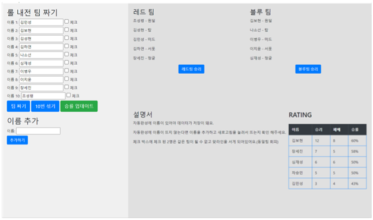
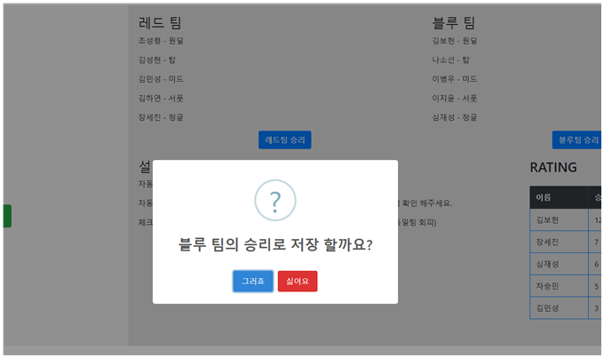

# 🔍 Random_lolteam

**Random_lolteam**은 5대5 게임시 10명을 랜덤으로 팀 및 역할배정을 도와주는 웹 사이트 입니다.

## 🖥️ 프로젝트 개요

- 🧩 **개발 환경**: XAMPP (Apache + MySQL)
- 🛠️ **구현 방식**: PHP 기반 웹 사이트
- 🗃️ **데이터베이스**: MySQL
- 🎯 **주요 기능**:
  - 10명의 팀원 팀 및 역할 배정
  - 승률 저장
  - 승률 표시

---

## ⚙️ 기술 스택

| 구성 요소      | 사용 기술                |
|----------------|--------------------------|
| 백엔드         | PHP, MySQL               |
| 프론트엔드     | HTML, CSS, JavaScript    |
| 서버           | Apache(XAMPP)          |
| 데이터베이스    | MySQL                    |

---

## 🚩 실행 시 꼭 읽어주세요!
1. **XAMPP 설치**
- [XAMPP 공식 사이트](https://www.apachefriends.org/index.html)

3. **프로젝트 파일 복사**
- 파일을 `htdocs` 디렉터리에 파일을 만들어 복사합니다.

5. **MySql 데이터베이스 설정**
- XAMPP Control Panel에서 Apache 실행 
- 스키마, 테이블을 미리 생성해주셔여 합니다.
- 스키마 이름: lolteam
- 테이블 이름: base
- 테이블 칼럼: Name(VARCHAR(45)), Win, Lose, Sum, Rating
- Name외 모든 칼럼의 데이터타입은 INT로 해주셔야합니다.

4. **사이트 접속**
- lolteam4.php에 접속합니다.

5. **주의 사항!!**
- 이름 작성시 자동완성이 있어야 데이터가 저장이 됩니다.
- 자동완성에 이름이 뜨지 않는 다면 이름을 추가하고 새로고침을 눌러서 뜨는지 확인해야합니다.
- 체크 박스에 체크 된 2명은 같은 팀이 될 수 없고 맞라인을 서게 되어있습니다.(동일팀 회피) 선택 사항

--

## 🌄 화면 미리보기

Random_lolteam의 주요 화면들을 아래에서 확인하실 수 있습니다.

<table>
  <tr>
    <td align="center"><b>🏠 메인 페이지</b></td>
    <td align="center"><b>📄 팀 배정</b></td>
  </tr>
  <tr>
    <td></td>
    <td></td>
  </tr>
  <tr>
    <td align="center"><b>📄 DB이름 추가</b></td>
    <td align="center"><b>📄 승패저장</b></td>
  </tr>
  <tr>
    <td></td>
    <td></td>
  </tr>
</table>

---

## 📌 향후 개선 방향

- DB 스키마 및 테이블 자동 생성 스크립트 개발
- 승률에 따른 팀원 배치

---

## 📮 문의
급하게 만들어 부족한 부분이 많습니다. 좋은 의견 받습니다!
- 디자인: **김보현**
- 백엔드, 프론트 개발자: **김보현**  
- 이메일: `qhgus9346@gmail.com`
